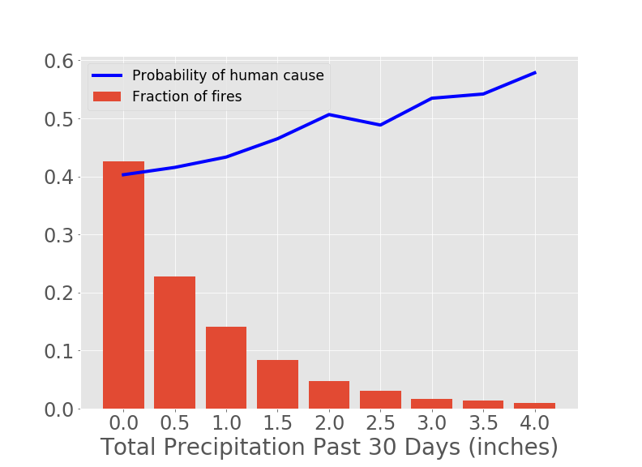

# Predicting the Cause of Wildfires

The objective of this project is to create a tool to optimize the process of wildfire investigations.

### Business Understanding
 
Washington’s Department of Natural Resources is required by law to recover the suppression costs of wildfires in state or protected lands, whenever the fire was criminally or negligently caused.  With more than 1000 wildfires occurring all across Washington every year, identifying the fires that are most likely to be human-caused could enable prioritization and more efficient use of department resources.

|  | 
|:--:| 
| *Location of Washington wildifires in 2014* |

### Data Understanding

#### Data Sources

* Spatial Wildfire Occurrence Data for the United State 1992-2015, published by [USDA Forest Service](https://www.fs.usda.gov/rds/archive/Product/RDS-2013-0009.4/).  Contains latitude, longitude, date, cause and size of wildfires across the US.  
* Weather data from [NOAA](https://www.ncdc.noaa.gov/cdo-web/datasets), including daily precipitation and minimum and maximum temperatures from over over 1000 weather stations in Washington. 
* Population density data from [United States Census Bureau](https://catalog.data.gov/dataset/tiger-line-shapefile-2010-2010-state-washington-2010-census-block-state-based-shapefile-with-ho) 

#### Feature Engineering

Data from different sources were combined to engineer features that, given a fire, are predictive of the probability that it was caused by human activity.  Specifically, the latitude and longitude of each fire is used to obtain the population density at that location.  Additionaly, data from the nearest weather station is used to create aggregate weather features.

|  | 

As an example, consider the total precipitation during the 30 days prior to the start of a fire, shown below.  As expected, most fires take place during very dry months.  However, given that there is a fire, the conditional probability that it was casued by human activity actually increases as the amount of precipitation goes up.

|  | 
|:--:| 
| *Fraction of fires and probability of human cause as a function of the total precipitation during the 30 days prior to the start of the fire.* |

### Modeling

A gradient boosted soft classifier was trained to predict the probability that the cause of a fire is due to human activity. This predicted probability is then used to calculate the expected return for the state, taking into account the size of the fire and the cost of the investigation.  

The currently open cases, prioritized according the model predictions, are displayed in a dahsboard for investigators, which is deployed as a web app [here](http://fireinvestigator.online).

|  | 
|:--:| 
| *Schematic of model flow and deployment* |

### Evaluation

* Cross validation using log-loss.  If there are multi-year cycles or trends that vary over 24 year period of the data, I may need to split the train-test sets based on year.
* Look at the confusion matrix.
* Look at univariate plots for both actual and predicted probabilities to identify trends that the model may not be capturing.

### Deployment

A simple web app that can be used by fire departments or state authorities.  It would have the following functions:

* Input: The locations and discovery dates of current fires.  
  Output: A priority list ranking the fires based on the expected value of the recovered  cost.
	This would be useful in situations where a fixed number of investigators is available.
* Input: location and discovery date of a fire.
  Output: Expected value of the cost or recovered funds if the investigation is carried out.  This would enable an informed     decision on whether or not to investigate.  

### Sources
https://www.dnr.wa.gov/Investigations  
https://www.ncdc.noaa.gov/cdo-web/search   
https://www.fs.usda.gov/rds/archive/Product/RDS-2013-0009.4/

