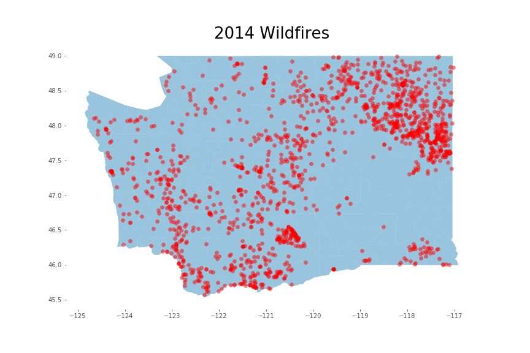

# Predicting the Cause of Wildfires

The objective of this project is to create a tool to optimize the process of wildfire investigations.

### Business Understanding
 
Washington’s Department of Natural Resources is required by law to recover the suppression costs of wildfires in state or protected lands, whenever the fire was criminally or negligently caused.  With more than 1000 wildfires occurring all across Washington every year, identifying the fires that are most likely to be human-caused could enable prioritization and more efficient use of department resources.

|  | 
|:--:| 
| *Location of Washington wildifires in 2014* |

### Data Understanding

#### Data Sources

* Spatial Wildfire Occurrence Data for the United State 1992-2015, published by [USDA Forest Service](https://www.fs.usda.gov/rds/archive/Product/RDS-2013-0009.4/).  Contains latitude, longitude, date, cause and size of wildfires across the US.  
* Weather data from [NOAA](https://www.ncdc.noaa.gov/cdo-web/datasets), including daily precipitation and minimum and maximum temperatures from over over 1000 weather stations in Washington. 
* Population density data from [United States Census Bureau](https://catalog.data.gov/dataset/tiger-line-shapefile-2010-2010-state-washington-2010-census-block-state-based-shapefile-with-ho) 

#### Feature Engineering

|  | 

* Group the possible causes into two categories: criminal/negligent and other.  We care about the probability that the cause of the fire is one for which the state can expect to recover the containment cost.
* Use the coordinates of the weather stations to match the location of a fire to the weather conditions at the nearest station during the days/weeks prior to the fire.  
* Most weather stations collect precipitation data, but only about ⅓ have temperature data.  
* Bin the latitude and longitude to create a “time since last fire” variable for each location.
* Do some research to obtain estimates of the cost of an investigation as well as the containment cost of fires based on their size.

### Modeling

* Soft classification models, e.g.: logistic regression, gradient boosting.

Time permitting:
* Some sort of clustering to engineer features that can feed into the above listed models.
* An additional model that can be used to predict the size of the fire with only small modifications to the data pipeline.  This would inform the expected cost that could be recovered.

### Evaluation

* Cross validation using log-loss.  If there are multi-year cycles or trends that vary over 24 year period of the data, I may need to split the train-test sets based on year.
* Look at the confusion matrix.
* Look at univariate plots for both actual and predicted probabilities to identify trends that the model may not be capturing.

### Deployment

A simple web app that can be used by fire departments or state authorities.  It would have the following functions:

* Input: The locations and discovery dates of current fires.  
  Output: A priority list ranking the fires based on the expected value of the recovered  cost.
	This would be useful in situations where a fixed number of investigators is available.
* Input: location and discovery date of a fire.
  Output: Expected value of the cost or recovered funds if the investigation is carried out.  This would enable an informed     decision on whether or not to investigate.  

### Sources
https://www.dnr.wa.gov/Investigations  
https://www.ncdc.noaa.gov/cdo-web/search   
https://www.fs.usda.gov/rds/archive/Product/RDS-2013-0009.4/

